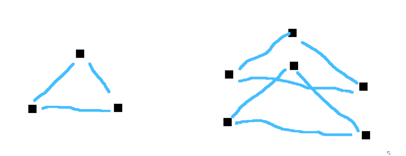
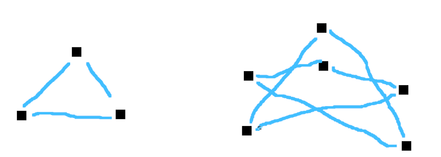

# Konstrukcija Ramanujanivih grafov
## Ramanujanova domneva

# Konstrukcija dvodelnih ramanujanovih grafov

Članek [Interlacing Families I: Bipartite Ramanujan Graphs of All Degrees](https://arxiv.org/pdf/1304.4132.pdf)

## Intro
Vsi d-regularni grafi imajo lastno vrednost matrike sosednosti \(d\). Natanko dvodelni imajo tudi \(-d\).
Graf je Ramanujanov, če so vse ostale lastne vrednosti v \([-2\sqrt{d-1}, 2\sqrt{d-1}]\).

Enostavno je najti Ramanujanove grafe (npr. \(K_n\)). Težava je poiskati neskončno družino Ramanujanovih grafov za fiksni \(d\) (kjer je \(d\) stopnja regularnosti) (pri polnih grafih ta narašča)

## 2-dvig

Imamo graf G=(V, E). Vsako vozlišče podvojimo (par vozlišč je vlakno).
Če smo imeli prej povezavo \((u, v)\) in je \(\{u_0, u_1}\) vlakno \(u\) in \(\{v_0, v_1}\) vlakno \(v\), potem dvig lahko vsebuje povezave tipa
- \((u_0, v_0) \land (u_1, v_1)\)
- \((u_0, v_1) \land (u_1, v_0)\)

Zaradi nekega razloga ne dovolimo obeh povezav med istima vozliščema hkrati.

Če ima samo prvega, dobimo dve kopiji G.

Če vsebuje samo povezave drugega tipa dobimo dobimo "dvojni krov" G.

Matriko sosednosti dviga se lahko definira kot matriko sosednosti G, le da so vrednosti -1, če je povezava drugega tipa (in +1, če prvega tipa). Lastne vrednosti dvignjenega grafa so unija prejšnjih lastnih vrednosti, in lastnih vrednosti nove matrike sosednosti.

Pokazali so, da ima vsak graf (z kvečjemu \(d\) sosedov) izbiro povezav, da so lastne vrednosti dviga \(O(\sqrt{d\log^3(d)})\). Potem delajo expander grafe, da delajo 2-dvige d-regularnega grafa. Sumili so, da obstaja izbira dviga, da so absolutne lastne vrednosti kvečjemu \(2\sqrt{d-1}\). Če delamo z dvodelnimi grafi vemo, da so lastne vrednosti simetrične. Torej lahko dokažemo le, da so manjše od \(2\sqrt{d-1}\) in absolutnost sledi (in iz tega Ramanujanost).

## Irregularni ramanujanovi grafi
Graf je \((c,d)\)-biregularen, če je dvodelen in ena particija stopnje \(c\), druga stopnje \(d\). Vedno ima trivialne lastne vrednosti \(\pm\sqrt{cd}\) Je Ramanujanov, če so netrivialne lastne vrednosti po absolutni vrednosti manjše od \(\sqrt{c-1} + \sqrt{d-1}\). Dokažejo obstoj neskončnih družin Ramanujanovih grafov za vse \(c, d\geq 3\)

# Reading list
[New and Explicit Constructions of Unbalanced Ramanujan Bipartite Graphs](https://arxiv.org/pdf/1910.03937.pdf)